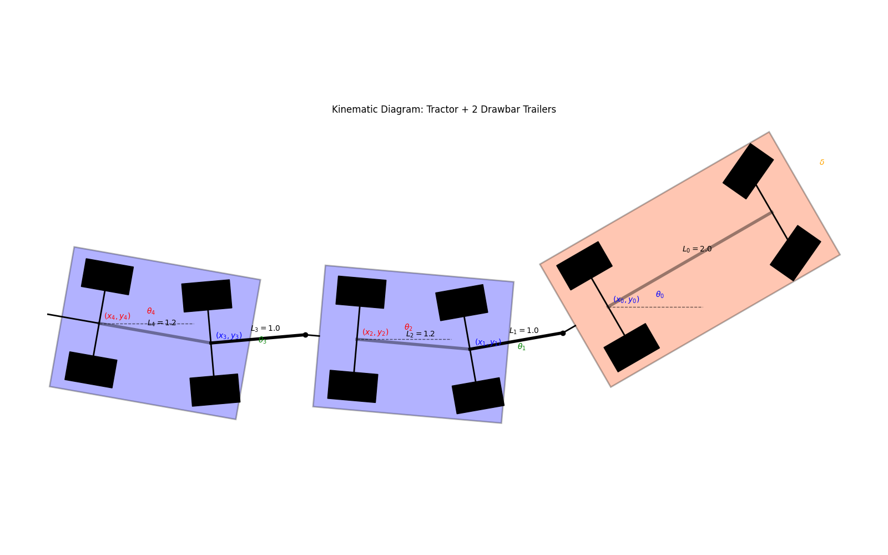
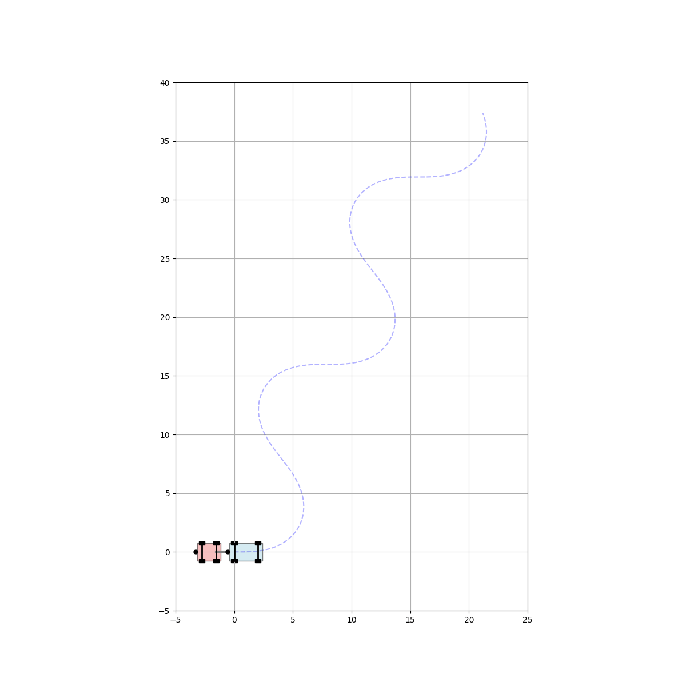

# Kinematic Model of Tractor with Drawbar Trailers

This project implements a kinematic model and simulation for a **Multi-Trailer System** consisting of a tractor and **N** drawbar trailers. The model uses standard bicycle kinematics extended to a chain of rigid bodies using a recursive formulation.

## 1. System Description

The system consists of a Tractor followed by $N$ trailer units. Each trailer unit consists of a Drawbar and a Trailer Body.
The system is fully configurable, allowing for an arbitrary number of trailers with custom dimensions.

### Kinematic Diagram (Example with 4 Trailers)


---

## 2. System Kinematics Vector

The system kinematics is defined by **$3 + 4N$ variables** (where $N$ is the number of trailers):

$$
\mathbf{q}_{kin} = [\dot{x}_0, \dot{y}_0, \dot{\theta}_0, \underbrace{v_1, \dot{\theta}_1, v_2, \dot{\theta}_2}_{\text{Trailer 1}}, \dots, \underbrace{v_{2N-1}, \dot{\theta}_{2N-1}, v_{2N}, \dot{\theta}_{2N}}_{\text{Trailer N}}]^T 
$$ 


| Variable | Description | Unit |
| :--- | :--- | :--- |
| $\dot{x}_0, \dot{y}_0$ | Velocity of the Tractor's rear axle center (World Frame) | m/s |
| $\dot{\theta}_0$ | Angular Velocity of the Tractor | rad/s |
| $v_{2i-1}$ | Longitudinal Velocity of Dolly $i$ | m/s |
| $\dot{\theta}_{2i-1}$ | Angular Velocity of Drawbar $i$ | rad/s |
| $v_{2i}$ | Longitudinal Velocity of Trailer $i$ | m/s |
| $\dot{\theta}_{2i}$ | Angular Velocity of Trailer $i$ | rad/s |

**Inputs**:
*   $v_0$: Longitudinal velocity of the Tractor.
*   $\delta$: Steering angle of the Tractor's front wheels.

---

## 3. System Parameters

The system is configured via a list of trailer parameters. For each trailer unit $i$ (where $i=1 \dots N$):

| Parameter | Symbol | Description |
| :--- | :--- | :--- |
| **Tractor** | $L_0$ | Wheelbase |
| | $d_h$ | Hitch offset (behind rear axle) |
| **Trailer $i$** | $L_{bar,i}$ | Drawbar Length |
| | $L_{trl,i}$ | Trailer Length (Dolly to Axle) |
| | $d_{h,i}$ | Hitch offset (behind rear axle of Trailer $i$) |
| **General** | $W$ | Track Width (for visualization) |

---

## 4. Mathematical Model

The equations of motion are derived assuming **no slip** conditions (non-holonomic constraints) for all wheels.

### 4.1 Tractor Kinematics
The tractor follows the standard kinematic bicycle model:

$$ \dot{x}_0 = v_0 \cos\theta_0 $$

$$ \dot{y}_0 = v_0 \sin\theta_0 $$

$$ \dot{\theta}_0 = \frac{v_0}{L_0} \tan\delta $$

### 4.2 Trailer 1 Kinematics
The motion of the first trailer is driven by the velocity of **Hitch 1** ($H_1$).

**Hitch 1 Velocity**:

$$ v_{hx} = v_0 \cos\theta_0 + d_h \dot{\theta}_0 \sin\theta_0 $$

$$ v_{hy} = v_0 \sin\theta_0 - d_h \dot{\theta}_0 \cos\theta_0 $$

> **Derivation Note**:
> The signs differ because of the derivatives of the trigonometric functions.
> *   For $x_h = x_0 - d_h \cos\theta_0$: The derivative of $\cos\theta_0$ is $-\sin\theta_0 \cdot \dot{\theta}_0$. The two negatives cancel out $\rightarrow + d_h \dot{\theta}_0 \sin\theta_0$.
> *   For $y_h = y_0 - d_h \sin\theta_0$: The derivative of $\sin\theta_0$ is $\cos\theta_0 \cdot \dot{\theta}_0$. The negative sign remains $\rightarrow - d_h \dot{\theta}_0 \cos\theta_0$.

**Drawbar 1 Rotation ($\dot{\theta}_1$)**:
Driven by the hitch velocity component perpendicular to the drawbar:

$$ \dot{\theta}_1 = \frac{1}{L_1} \left( v_0 \sin(\theta_0 - \theta_1) - d_h \dot{\theta}_0 \cos(\theta_0 - \theta_1) \right) $$

**Trailer 1 Rotation ($\dot{\theta}_2$)**:
Driven by the velocity of the Dolly 1 axle ($v_1$) pulling the trailer:

$$ v_1 = v_0 \cos(\theta_0 - \theta_1) + d_h \dot{\theta}_0 \sin(\theta_0 - \theta_1) $$

$$ \dot{\theta}_2 = \frac{v_1}{L_2} \sin(\theta_1 - \theta_2) $$

**Linear Velocities**:
*   **Dolly 1 Velocity ($v_1$)**:

    $$ v_1 = v_0 \cos(\theta_0 - \theta_1) + d_h \dot{\theta}_0 \sin(\theta_0 - \theta_1) $$

*   **Trailer 1 Axle Velocity ($v_2$)**:

    $$ v_2 = v_1 \cos(\theta_1 - \theta_2) $$

### 4.3 Trailer 2 Kinematics
The motion of the second trailer is driven by the velocity of **Hitch 2** ($H_2$), located at the rear of Trailer 1.

**Hitch 2 Velocity**:

$$ v_{h2,\perp} = v_2 \sin(\theta_2 - \theta_3) - d_{h2} \dot{\theta}_2 \cos(\theta_2 - \theta_3) $$

where $v_2 = v_1 \cos(\theta_1 - \theta_2)$ is the velocity of Trailer 1's axle.

**Drawbar 2 Rotation ($\dot{\theta}_3$)**:

$$ \dot{\theta}_3 = \frac{1}{L_3} \left( v_2 \sin(\theta_2 - \theta_3) - d_{h2} \dot{\theta}_2 \cos(\theta_2 - \theta_3) \right) $$

**Trailer 2 Rotation ($\dot{\theta}_4$)**:
Driven by the velocity of the Dolly 2 axle ($v_3$):

$$ v_3 = v_2 \cos(\theta_2 - \theta_3) + d_{h2} \dot{\theta}_2 \sin(\theta_2 - \theta_3) $$

$$ \dot{\theta}_4 = \frac{v_3}{L_4} \sin(\theta_3 - \theta_4) $$

**Linear Velocities**:
*   **Dolly 2 Velocity ($v_3$)**:

    $$ v_3 = v_2 \cos(\theta_2 - \theta_3) + d_{h2} \dot{\theta}_2 \sin(\theta_2 - \theta_3 $$

*   **Trailer 2 Axle Velocity ($v_4$)**:

    $$ v_4 = v_3 \cos(\theta_3 - \theta_4) $$

### 4.4 Trailer 3 Kinematics
The motion of the third trailer is driven by the velocity of **Hitch 3** ($H_3$), located at the rear of Trailer 2.

**Hitch 3 Velocity**:

$$ v_{h3,\perp} = v_4 \sin(\theta_4 - \theta_5) - d_{h3} \dot{\theta}_4 \cos(\theta_4 - \theta_5) $$
where $v_4 = v_3 \cos(\theta_3 - \theta_4)$ is the velocity of Trailer 2's axle.

**Drawbar 3 Rotation ($\dot{\theta}_5$)**:

$$ \dot{\theta}_5 = \frac{1}{L_5} \left( v_4 \sin(\theta_4 - \theta_5) - d_{h3} \dot{\theta}_4 \cos(\theta_4 - \theta_5) \right) $$

**Trailer 3 Rotation ($\dot{\theta}_6$)**:
Driven by the velocity of the Dolly 3 axle ($v_5$):

$$ v_5 = v_4 \cos(\theta_4 - \theta_5) + d_{h3} \dot{\theta}_4 \sin(\theta_4 - \theta_5) $$

$$ \dot{\theta}_6 = \frac{v_5}{L_6} \sin(\theta_5 - \theta_6) $$

**Linear Velocities**:
*   **Dolly 3 Velocity ($v_5$)**:

    $$ v_5 = v_4 \cos(\theta_4 - \theta_5) + d_{h3} \dot{\theta}_4 \sin(\theta_4 - \theta_5) $$

*   **Trailer 3 Axle Velocity ($v_6$)**:

    $$ v_6 = v_5 \cos(\theta_5 - \theta_6) $$

### 4.5 Trailer 4 Kinematics
The motion of the fourth trailer is driven by the velocity of **Hitch 4** ($H_4$), located at the rear of Trailer 3.

**Hitch 4 Velocity**:

$$ v_{h4,\perp} = v_6 \sin(\theta_6 - \theta_7) - d_{h4} \dot{\theta}_6 \cos(\theta_6 - \theta_7) $$
where $v_6 = v_5 \cos(\theta_5 - \theta_6)$ is the velocity of Trailer 3's axle.

**Drawbar 4 Rotation ($\dot{\theta}_7$)**:

$$ \dot{\theta}_7 = \frac{1}{L_7} \left( v_6 \sin(\theta_6 - \theta_7) - d_{h4} \dot{\theta}_6 \cos(\theta_6 - \theta_7) \right) $$

**Trailer 4 Rotation ($\dot{\theta}_8$)**:
Driven by the velocity of the Dolly 4 axle ($v_7$):

$$ v_7 = v_6 \cos(\theta_6 - \theta_7) + d_{h4} \dot{\theta}_6 \sin(\theta_6 - \theta_7) $$

$$ \dot{\theta}_8 = \frac{v_7}{L_8} \sin(\theta_7 - \theta_8) $$

**Linear Velocities**:
*   **Dolly 4 Velocity ($v_7$)**:

    $$ v_7 = v_6 \cos(\theta_6 - \theta_7) + d_{h4} \dot{\theta}_6 \sin(\theta_6 - \theta_7) $$

*   **Trailer 4 Axle Velocity ($v_8$)**:

    $$ v_8 = v_7 \cos(\theta_7 - \theta_8) $$

---

## 5. Matrix Form (Recursive Formulation)

To support an arbitrary number of trailers, the system kinematics can be formulated recursively. Let $\mathbf{v}_i = [v_i, \dot{\theta}_i]^T$ be the velocity vector of the $i$-th unit (where $i=0$ is the tractor, $i=1$ is Drawbar 1, $i=2$ is Trailer 1, etc.).

The relationship between consecutive units is given by linear transformations:

### 1. Tractor Input
The tractor's velocity vector $\mathbf{v}_0$ is determined by the inputs $v_0$ and $\delta$:

$$ \mathbf{v}_0 = \begin{bmatrix} v_0 \\ \dot{\theta}_0 \end{bmatrix} = \begin{bmatrix} 1 \\ \frac{1}{L_0}\tan\delta \end{bmatrix} v_0 $$

### 2. Transformation A: Tractor/Trailer $\to$ Drawbar
Calculates the velocity of a Drawbar ($i=2k-1$) from the preceding Tractor or Trailer ($i-1$).
Let $\Delta\theta = \theta_{i-1} - \theta_i$.

$$ \mathbf{v}_i = M_{A}(\Delta\theta) \mathbf{v}_{i-1} $$

$$ \begin{bmatrix} v_i \\ \dot{\theta}_i \end{bmatrix} = \begin{bmatrix} \cos\Delta\theta & d_h \sin\Delta\theta \\ \frac{1}{L_{bar}}\sin\Delta\theta & -\frac{d_h}{L_{bar}}\cos\Delta\theta \end{bmatrix} \begin{bmatrix} v_{i-1} \\ \dot{\theta}_{i-1} \end{bmatrix} $$
*   $L_{bar}$: Length of the drawbar ($L_1, L_3, \dots$)
*   $d_h$: Hitch offset of the preceding unit ($d_h, d_{h2}, \dots$)

### 3. Transformation B: Drawbar $\to$ Trailer
Calculates the velocity of a Trailer ($i=2k$) from the preceding Drawbar ($i-1$).
Let $\Delta\theta = \theta_{i-1} - \theta_i$.

$$ \mathbf{v}_i = M_{B}(\Delta\theta) \mathbf{v}_{i-1} $$

$$ \begin{bmatrix} v_i \\ \dot{\theta}_i \end{bmatrix} = \begin{bmatrix} \cos\Delta\theta & 0 \\ \frac{1}{L_{trl}}\sin\Delta\theta & 0 \end{bmatrix} \begin{bmatrix} v_{i-1} \\ \dot{\theta}_{i-1} \end{bmatrix} $$
*   $L_{trl}$: Length of the trailer ($L_2, L_4, \dots$)

### System Kinematics Vector
The full system kinematics vector $\mathbf{q}_{kin}$ is constructed by stacking these sub-vectors:

$$ \mathbf{q}_{kin} = [\dot{x}_0, \dot{y}_0, \mathbf{v}_0^T, \mathbf{v}_1^T, \mathbf{v}_2^T, \mathbf{v}_3^T, \mathbf{v}_4^T]^T $$

where $\dot{x}_0 = v_0 \cos\theta_0$ and $\dot{y}_0 = v_0 \sin\theta_0$.

---

## 6. Coordinate Calculation (Forward Kinematics)

The global coordinates $(x, y)$ of key points are calculated recursively from the state vector.

### Base Case: Tractor
1.  **Tractor Front Axle ($P_{0,f}$)**:

    $$ P_{0,f} = P_0 + L_0 \begin{bmatrix} \cos\theta_0 \\ \sin\theta_0 \end{bmatrix} $$

2.  **Hitch 1 ($H_1$)**:

    $$ H_1 = P_0 - d_h \begin{bmatrix} \cos\theta_0 \\ \sin\theta_0 \end{bmatrix} $$

### Specific Examples

#### Trailer 1
1.  **Dolly 1 ($P_1$)**:

    $$ P_1 = H_1 - L_1 \begin{bmatrix} \cos\theta_1 \\ \sin\theta_1 \end{bmatrix} $$

2.  **Axle 1 ($P_2$)**:

    $$ P_2 = P_1 - L_2 \begin{bmatrix} \cos\theta_2 \\ \sin\theta_2 \end{bmatrix} $$

#### Hitch 2 ($H_2$)

$$ H_2 = P_2 - d_{h2} \begin{bmatrix} \cos\theta_2 \\ \sin\theta_2 \end{bmatrix} $$

#### Trailer 2
1.  **Dolly 2 ($P_3$)**:

$$ P_3 = H_2 - L_3 \begin{bmatrix} \cos\theta_3 \\ \sin\theta_3 \end{bmatrix} $$

2.  **Axle 2 ($P_4$)**:

$$ P_4 = P_3 - L_4 \begin{bmatrix} \cos\theta_4 \\ \sin\theta_4 \end{bmatrix} $$

#### Hitch 3 ($H_3$)

$$ H_3 = P_4 - d_{h3} \begin{bmatrix} \cos\theta_4 \\ \sin\theta_4 \end{bmatrix} $$

#### Trailer 3
1.  **Dolly 3 ($P_5$)**:

$$ P_5 = H_3 - L_5 \begin{bmatrix} \cos\theta_5 \\ \sin\theta_5 \end{bmatrix} $$

2.  **Axle 3 ($P_6$)**:

$$ P_6 = P_5 - L_6 \begin{bmatrix} \cos\theta_6 \\ \sin\theta_6 \end{bmatrix} $$

#### Hitch 4 ($H_4$)

$$ H_4 = P_6 - d_{h4} \begin{bmatrix} \cos\theta_6 \\ \sin\theta_6 \end{bmatrix} $$

#### Trailer 4
1.  **Dolly 4 ($P_7$)**:

$$ P_7 = H_4 - L_7 \begin{bmatrix} \cos\theta_7 \\ \sin\theta_7 \end{bmatrix} $$

2.  **Axle 4 ($P_8$)**:

$$ P_8 = P_7 - L_8 \begin{bmatrix} \cos\theta_8 \\ \sin\theta_8 \end{bmatrix} $$

### Generalized Recursive Step: $k$-th Trailer Unit
For any trailer unit $k$ (where $k=1, 2, \dots, N$), consisting of Drawbar $k$ and Trailer $k$:

1.  **Dolly $k$ ($P_{2k-1}$)**:
    Calculated from the preceding hitch $H_k$.

$$ P_{2k-1} = H_k - L_{bar,k} \begin{bmatrix} \cos\theta_{2k-1} \\ \sin\theta_{2k-1} \end{bmatrix} $$

2.  **Axle $k$ ($P_{2k}$)**:
    Calculated from Dolly $k$.

$$ P_{2k} = P_{2k-1} - L_{trl,k} \begin{bmatrix} \cos\theta_{2k} \\ \sin\theta_{2k} \end{bmatrix} $$

3.  **Next Hitch ($H_{k+1}$)**:
    Calculated from Axle $k$ (if another trailer follows).

$$ H_{k+1} = P_{2k} - d_{h,k} \begin{bmatrix} \cos\theta_{2k} \\ \sin\theta_{2k} \end{bmatrix} $$

*   $L_{bar,k}$: Length of Drawbar $k$ ($L_1, L_3, \dots$)
*   $L_{trl,k}$: Length of Trailer $k$ ($L_2, L_4, \dots$)
*   $d_{h,k}$: Hitch offset of Trailer $k$ ($d_{h2}, \dots$)

---

## 7. Constraints

*   **Steering Limit**: $\delta \in [-30^\circ, 30^\circ]$
*   **Drawbar Limits**: Relative angle between units $\in [-30^\circ, 30^\circ]$
*   **Velocity Limit**: $v_0 \in [-5.0, 5.0]$ m/s

---

## 8. Usage

### Run Simulation
```bash
python3 simulate.py
```
*   Displays an interactive animation window.
*   Close the window to save the result to `simulation_full.gif`.
*   **Configuration**: Edit `SAVE_ANIMATION` in `simulate.py` to toggle saving.

### Generate Diagram
```bash
python3 create_diagram.py
```
*   Generates `kinematic_diagram_full.png` with default **S-shape** configuration.
*   **Custom Angles**: You can specify initial angles for all units:
    ```bash
    python3 create_diagram.py --theta0 30 --theta1 20 ... --save_path my_diagram.png
    ```
*   **Visual Aids**: Includes dashed reference lines for steering and drawbar angles to visualize articulation.

#### Example: Snake/S-Shape Configuration
```bash
python3 create_diagram.py --theta0 45 --theta1 25 --theta2 10 --theta3 -10 --theta4 -25 --theta5 -45 --theta6 -25 --theta7 -10 --theta8 25 --save_path s_shape.png
```

---

## 9. Simulation Result

Running `simulate.py` produces an animation of the vehicle trajectory.


