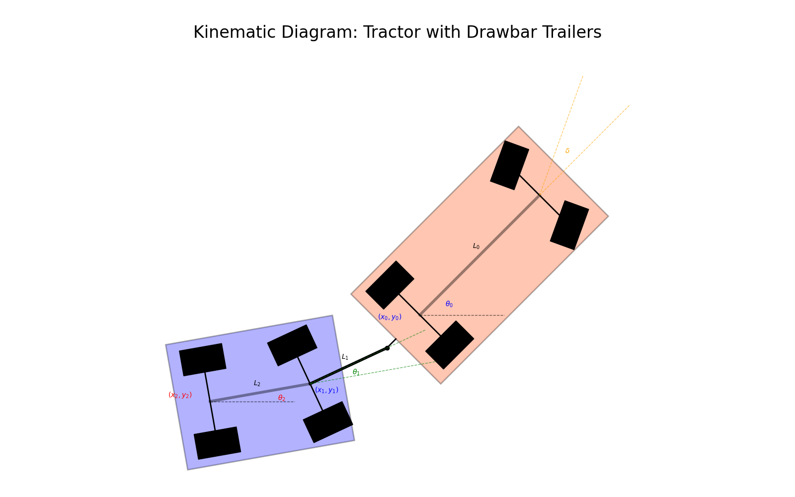
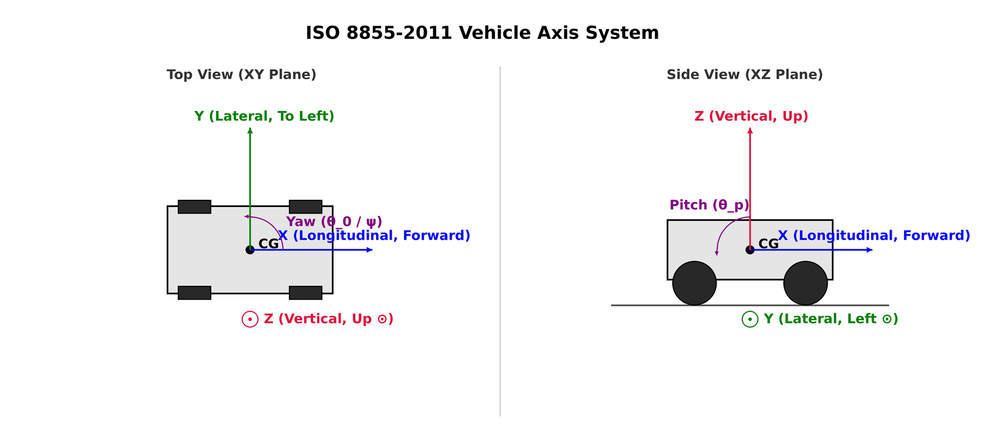

# แบบจำลองพลศาสตร์ของยานยนต์ลากจูง (Dynamic Model of a Towing Vehicle)

เอกสารฉบับนี้จัดทำขึ้นเพื่อแสดงการอนุพันธ์ทางคณิตศาสตร์ (Mathematical Derivation) ของแบบจำลองพลศาสตร์ระนาบ (Planar Dynamic Model) สำหรับระบบรถลากจูงและส่วนพ่วงแบบดอลลี่และตัวพ่วง (Tractor + Drawbar Dolly + Trailer Body) โดยเน้นไปที่การประยุกต์ใช้ **วิธีลากรานเจียน (Lagrangian Dynamics)** ในการจัดรูปสมการการเคลื่อนที่

---

## 0. Schematic and Coordinate Systems

### 0.1 Tracter with Drawbar Trailler Diagram

แบบจำลองนี้ประกอบด้วยวัตถุเกร็ง (Rigid Bodies) 3 ชิ้นหลัก เชื่อมต่อกันด้วยจุดพ่วงแบบหมุนได้ (Revolute Joints / Hitch Joints):
1. **รถลากจูง (Tractor)**: มีมวล $m$ มีจุดศูนย์กลางมวล (CG) อยู่ที่พิกัด $(x_0, y_0)$ ในพิกัดโลก และมีทิศทางมุมหัวรถ (Yaw Angle) เท่ากับ $\theta_0$
2. **ดอลลี่ (Drawbar Dolly)**: มีมวล $m_d$ เชื่อมต่อกับท้ายรถลากจูงที่จุดพ่วง $H_1$ และมีมุมหัวดอลลี่เท่ากับ $\theta_1$
3. **ส่วนพ่วงหลัก (Trailer Body)**: มีมวล $m_t$ เชื่อมต่อกับดอลลี่ที่จุดพ่วงตัวที่สอง $H_2$ (Fifth Wheel Joint) และมีมุมหัวรถพ่วงเท่ากับ $\theta_2$

#### การอธิบายพารามิเตอร์จากแผนภาพ (Parameters Explanation)
| สัญลักษณ์ (Symbol) | ประเภท (Category) | คำอธิบายภาษาไทย (Thai Description) | คำอธิบายภาษาอังกฤษ (English Description) |
| :---: | :--- | :--- | :--- |
| **$(x_0, y_0)$** | พิกัด / ตำแหน่ง | กึ่งกลางเพลาหลังของรถลากจูง (จุดอ้างอิงหลัก) | Tractor Rear Axle Center |
| **$(x_1, y_1)$** | พิกัด / ตำแหน่ง | จุดศูนย์กลางเพลาของดอลลี่ | Dolly Axle Center |
| **$(x_2, y_2)$** | พิกัด / ตำแหน่ง | กึ่งกลางเพลาหลังของรถพ่วงหลัก | Trailer Rear Axle Center |
| **$H_1 (x_{h1}, y_{h1})$** | จุดต่อ / ข้อต่อ | จุดพ่วงแรก ระหว่างรถลากจูงและคานลากดอลลี่ | Hitch 1 (Tractor to Dolly) |
| **$H_2 (x_{h2}, y_{h2})$** | จุดต่อ / ข้อต่อ | จุดพ่วงที่สอง ระหว่างดอลลี่และรถพ่วงหลัก | Hitch 2 (Dolly to Trailer) |
| **$L_0$** | เรขาคณิต / ขนาด | ระยะฐานล้อของรถลากจูง | Tractor Wheelbase |
| **$L_1$** | เรขาคณิต / ขนาด | ความยาวของคานลากจูงดอลลี่ จาก $H_1$ ถึงเพลา | Drawbar Length |
| **$L_2$** | เรขาคณิต / ขนาด | ระยะฐานล้อของตัวพ่วงหลัก จาก $H_2$ ถึงเพลา | Trailer Wheelbase |
| **$d_h$** | เรขาคณิต / ขนาด | ระยะยื่นจากเพลาหลังรถลากจูงถึงจุดพ่วง $H_1$ | Tractor Rear Overhang |
| **$\theta_0$** | มุม / ทิศทาง | มุมหัวรถลากจูง เทียบกับแกนระดับโลก $X$ | Tractor Yaw Angle |
| **$\theta_1$** | มุม / ทิศทาง | มุมคานลากจูงดอลลี่ เทียบกับแกนระดับโลก $X$ | Dolly Yaw Angle |
| **$\theta_2$** | มุม / ทิศทาง | มุมหัวรถพ่วงหลัก เทียบกับแกนระดับโลก $X$ | Trailer Yaw Angle |
| **$\delta$** | มุม / ทิศทาง | มุมเลี้ยวของล้อหน้าเทียบกับแกนตามยาวของรถ | Front Wheel Steer Angle |

### 0.2 ระบบพิกัดตามมาตรฐาน ISO 8855-2011 (Vehicle Axis System ISO 8855-2011)

ระบบพิกัดที่ใช้อ้างอิงตามมาตรฐานสากล **ISO 8855-2011** สำหรับพลศาสตร์ยานยนต์ เป็นระบบพิกัดมือขวา (Right-Handed Coordinate System):
*   **พิกัดโลก (Global Inertial Frame: $OXY$)**: พิกัดอ้างอิงเฉื่อยบนพื้นระนาบโลกสำหรับการคำนวณตำแหน่งสัมบูรณ์
*   **พิกัดอ้างอิงตัวรถ (Body-Fixed Frame: $Cxyz$)**: พิกัดที่ยึดติดอยู่กับวัตถุแข็งเกร็งแต่ละชิ้น
    *   **แกน $x$ (Longitudinal Axis)**: ชี้ไปทางด้านหน้าของตัวรถ
    *   **แกน $y$ (Lateral Axis)**: ชี้ไปทางด้านซ้ายของตัวรถ
    *   **แกน $z$ (Vertical Axis)**: ชี้ขึ้นด้านบนในแนวตั้งฉากกับพื้นโลก
*   **มุมและการหมุน**:
    *   **มุมหัวรถ (Yaw Angle: $\theta$ / $\psi$)**: หมุนรอบแกน $z$ (Yaw Rate คือ $r = \dot{\theta}$) มีทิศทางเป็นบวกเมื่อหมุนทวนเข็มนาฬิกา

---

## 1. Origin and Principles of the Method

การวิเคราะห์พลศาสตร์ของระบบหลายชิ้นส่วน (Multi-Body Dynamics) ที่มีการเชื่อมต่อกันด้วยจุดพ่วง สามารถทำได้โดยใช้วิธีพลังงานเพื่อลดความซับซ้อนของการคำนวณแรงปฏิกิริยาภายใน

### 1.2 วิธีลากรานเจียน (Lagrangian Dynamics) สำหรับระบบหลายชิ้นส่วน (Multi-Body Systems)

วิธีลากรานเจียนอาศัยการวิเคราะห์พลังงานรวมของระบบ ซึ่งมีความสะดวกและเป็นระบบสำหรับการวิเคราะห์โครงสร้างแบบลูกโซ่ (Kinematic Chains)

#### การออกแบบพิกัดทั่วไป (Generalized Coordinates Design)
เพื่อให้สามารถอธิบายสถานะการเคลื่อนที่ของระบบได้อย่างสมบูรณ์ในระดับพื้นฐานที่สุดก่อนพิจารณาแรงกระทำหรือข้อต่อเชื่อม เราจำเป็นต้องกำหนดพิกัดทั่วไป (Generalized Coordinates) เนื่องจากระบบประกอบด้วยวัตถุแข็งเกร็ง (Rigid Bodies) 3 ชิ้น (รถลากจูง, ดอลลี่, รถพ่วงหลัก) โดยวัตถุแต่ละชิ้นเคลื่อนที่อิสระบนระนาบ 2 มิติ (Planar Motion) จะมีระดับความอิสระ (Degrees of Freedom) 3 ระดับ ได้แก่ ตำแหน่งตามแนวแกน X, แนวแกน Y, และการหมุน (Yaw) 

ดังนั้น ระบบตั้งต้นนี้มีพิกัดทั่วไปทั้งหมด 9 ตัวแปร:
$$q = [x_0, y_0, \theta_0, x_d, y_d, \theta_1, x_t, y_t, \theta_2]^T \in \mathbb{R}^9$$

#### สมการออยเลอร์-ลากรานจ์ (Euler-Lagrange Equation)
สมการพื้นฐานสอดคล้องกับการอนุรักษ์พลังงานในระบบที่มีเพียงพลังงานจลน์ $T$ และพลังงานศักย์ $V$:
$$\frac{d}{dt}\left(\frac{\partial L}{\partial \dot{q}_i}\right) - \frac{\partial L}{\partial q_i} = 0$$
โดยที่ $L = T - V$

สำหรับระบบของยานพาหนะที่มีแรงสัมผัสยางภายนอกที่ไม่ใช่อนุรักษ์พลังงาน (Non-conservative Forces) $Q_j$ และมีแรงปฏิกิริยาที่จุดพ่วง (Hitch Forces) กระทำอยู่ สมการจะขยายรูปแบบเพื่อรวมแรงภายนอกเหล่านี้เข้าไป:
$$\frac{d}{dt}\left(\frac{\partial L}{\partial \dot{q}_j}\right) - \frac{\partial L}{\partial q_j} = Q_j + F_{h,j}$$
โดยที่ $F_{h,j}$ คือแรงปฏิกิริยาพ่วงรวมที่กระทำต่อพิกัด $j$ ซึ่งเป็นตัวแทนเชิงคณิตศาสตร์ของแรงดึงพ่วง ($\lambda$) ที่ตำแหน่งข้อต่อต่างๆ

### 1.3 ที่มาของความเร็วเชิงเส้นในพิกัดโลก (Derivation of Linear Velocities)
เพื่อให้สามารถเขียนสมการพลังงานจลน์ได้ เราต้องหาความเร็วของจุดศูนย์กลางมวลของวัตถุแต่ละชิ้นในพิกัดโลก:

**1. รถลากจูง (Tractor):**
ตำแหน่งของจุดศูนย์กลางมวลอยู่ที่เพลาหลัง $(x_0, y_0)$ ความเร็วคำนวณจากแบบจำลองจักรยาน:
$$\dot{x}_0 = v_0 \cos\theta_0$$
$$\dot{y}_0 = v_0 \sin\theta_0$$
$$\dot{\theta}_0 = \frac{v_0}{L_0} \tan\delta$$

**2. ดอลลี่ (Drawbar Dolly):**
พิกัดศูนย์กลางมวลของดอลลี่ $(x_d, y_d)$ เชื่อมต่อกับท้ายรถลากจูง:
$$x_d = x_0 - d_h \cos\theta_0 - l_{fd} \cos\theta_1$$
$$y_d = y_0 - d_h \sin\theta_0 - l_{fd} \sin\theta_1$$
เมื่อหาอนุพันธ์เทียบกับเวลา (Time Derivative):
$$\dot{x}_d = \dot{x}_0 + d_h \dot{\theta}_0 \sin\theta_0 + l_{fd} \dot{\theta}_1 \sin\theta_1$$
$$\dot{y}_d = \dot{y}_0 - d_h \dot{\theta}_0 \cos\theta_0 - l_{fd} \dot{\theta}_1 \cos\theta_1$$

**3. รถพ่วงหลัก (Trailer Body):**
พิกัดศูนย์กลางมวลรถพ่วงหลัก $(x_t, y_t)$ เชื่อมต่อผ่านจุดพ่วงตัวที่สอง $H_2$:
$$x_t = x_d - l_{rd} \cos\theta_1 - l_{ft} \cos\theta_2 = x_0 - d_h \cos\theta_0 - (l_{fd} + l_{rd}) \cos\theta_1 - l_{ft} \cos\theta_2$$
$$y_t = y_d - l_{rd} \sin\theta_1 - l_{ft} \sin\theta_2 = y_0 - d_h \sin\theta_0 - (l_{fd} + l_{rd}) \sin\theta_1 - l_{ft} \sin\theta_2$$
เมื่อหาอนุพันธ์เทียบกับเวลา:
$$\dot{x}_t = \dot{x}_0 + d_h \dot{\theta}_0 \sin\theta_0 + (l_{fd} + l_{rd}) \dot{\theta}_1 \sin\theta_1 + l_{ft} \dot{\theta}_2 \sin\theta_2$$
$$\dot{y}_t = \dot{y}_0 - d_h \dot{\theta}_0 \cos\theta_0 - (l_{fd} + l_{rd}) \dot{\theta}_1 \cos\theta_1 - l_{ft} \dot{\theta}_2 \cos\theta_2$$

> **หมายเหตุการเปลี่ยนแปลงเครื่องหมาย:** เมื่ออนุพันธ์ฟังก์ชันทางเรขาคณิต $x_{\text{rear}} = x_{\text{front}} - d \cos\theta$ จะได้ $-\frac{d}{dt}(\cos\theta) = \dot{\theta}\sin\theta$ เครื่องหมายลบจึงหักล้างกันเปลี่ยนเป็น **บวก ($+$)** ส่วนแกน Y เครื่องหมายยังคงเป็นลบ

### 1.4 ที่มาของความเร็วเชิงมุมสำหรับส่วนพ่วง (Source of Trailer/Dolly Angular Velocities)
ในการกำหนดพฤติกรรมการหมุน ($\dot{\theta}_1, \dot{\theta}_2$) มีความแตกต่างระหว่างการวิเคราะห์ทางจลนศาสตร์และพลศาสตร์:

1. **ในแบบจำลองทางจลนศาสตร์ (Kinematic Model)**
   ความเร็วเชิงมุมจะถูกกำหนดไว้อย่างสมบูรณ์ด้วย **เงื่อนไขบังคับการไม่ลื่นไถลด้านข้างของล้อ (No-Side-Slip Constraint)** ที่เพลาล้อ โดยคำนวณจากความเร็วที่จุดพ่วง (Hitch Velocity) ซึ่งถูกฉาย (Project) เข้าสู่แนวตั้งฉากกับคานลากจูง:
   
   *   **ความเร็วเชิงมุมของดอลลี่ ($\dot{\theta}_1$)**: 
       ความเร็วที่จุดพ่วง $H_1$ ขับเคลื่อนการหมุนรอบแกนเพลาดอลลี่
       $$ v_{hx1} = v_0 \cos\theta_0 + d_h \dot{\theta}_0 \sin\theta_0 $$
       $$ v_{hy1} = v_0 \sin\theta_0 - d_h \dot{\theta}_0 \cos\theta_0 $$
       เมื่อพิจารณาความเร็วสัมพัทธ์ในแนวตั้งฉากกับคานลากจูง จะได้สมการความเร็วเชิงมุม:
       $$\dot{\theta}_1 = \frac{1}{L_1} \left( v_0 \sin(\theta_0 - \theta_1) - d_h \dot{\theta}_0 \cos(\theta_0 - \theta_1) \right)$$
       
   *   **ความเร็วเชิงมุมของรถพ่วงหลัก ($\dot{\theta}_2$)**:
       ความเร็วเชิงเส้นเดินหน้าของเพลาดอลลี่ ($v_1$) ทำหน้าที่ลากตัวพ่วงหลักที่จุดพ่วง $H_2$
       $$ v_1 = v_0 \cos(\theta_0 - \theta_1) + d_h \dot{\theta}_0 \sin(\theta_0 - \theta_1) $$
       เมื่อนำ $v_1$ มาฉายตั้งฉากกับคานของตัวพ่วงหลัก จะได้:
       $$\dot{\theta}_2 = \frac{v_1}{L_2} \sin(\theta_1 - \theta_2)$$

2. **ในแบบจำลองทางพลศาสตร์ (Dynamic Model)**
   เนื่องจากแบบจำลองพลศาสตร์ยอมให้หน้ายางเกิดการลื่นไถล (Tire Slip Angle $\alpha \neq 0$) ความเร็วเชิงมุมของดอลลี่ ($\dot{\theta}_1$) และรถพ่วงหลัก ($\dot{\theta}_2$) จึงมีสถานะเป็น **ตัวแปรสถานะอิสระ (Independent State Variables)** ของระบบ โดยค่าอนุพันธ์อันดับสอง ($\ddot{\theta}_1, \ddot{\theta}_2$) จะถูกคำนวณผ่านสมการการเคลื่อนที่ทางพลศาสตร์ผ่านผลรวมของโมเมนต์รอบจุดศูนย์กลางมวล

### 1.5 Kinetic and Potential Energy (พลังงานจลน์และพลังงานศักย์)

**พลังงานจลน์ (Kinetic Energy: $T$)**
พลังงานจลน์รวมของระบบเกิดจากผลรวมของพลังงานจลน์จากการเคลื่อนที่เชิงเส้นและการหมุนของวัตถุทั้ง 3 ชิ้น:
$$T = T_{\text{tractor}} + T_{\text{dolly}} + T_{\text{trailer}}$$
$$
T = \left[ \frac{1}{2}m(\dot{x}_0^2 + \dot{y}_0^2) + \frac{1}{2}I_z\dot{\theta}_0^2 \right] + \left[ \frac{1}{2}m_d(\dot{x}_d^2 + \dot{y}_d^2) + \frac{1}{2}I_{zd}\dot{\theta}_1^2 \right] + \left[ \frac{1}{2}m_t(\dot{x}_t^2 + \dot{y}_t^2) + \frac{1}{2}I_{zt}\dot{\theta}_2^2 \right]
$$

**พลังงานศักย์ (Potential Energy: $V$)**
พลังงานศักย์รวมของระบบพิจารณาจากระดับความสูงของศูนย์กลางมวลเทียบกับระนาบอ้างอิง:
$$V = V_{\text{tractor}} + V_{\text{dolly}} + V_{\text{trailer}}$$
เนื่องจากแบบจำลองนี้เป็นการพิจารณาพลศาสตร์การเคลื่อนที่บนพื้นระนาบระดับ (Planar Motion) ความสูงของจุดศูนย์กลางมวลของรถทุกชิ้นไม่มีการเปลี่ยนแปลงเทียบกับแรงโน้มถ่วง พลังงานศักย์ของระบบจึงมีค่าคงที่และสามารถกำหนดให้อ้างอิงเป็นศูนย์ได้สำหรับการแก้สมการ:
$$V = 0$$

### 1.6 ประกอบสมการ Lagrangian
ยานพาหนะเคลื่อนที่บนพื้นราบแนวระดับ ทำให้ไม่มีพลังงานศักย์โน้มถ่วงเข้ามาเกี่ยวข้อง ($V = 0$) ส่งผลให้ $L = T - V = T$ 

การสร้างสมการการเคลื่อนที่ จะพิจารณาให้แรงที่จุดพ่วงทำหน้าที่เป็นแรงภายนอก ($F_h$) กระทำต่อระบบ โดยกำหนดให้:
*   $\lambda_1, \lambda_2$ คือ แรงปฏิกิริยาพ่วงที่จุด $H_1$ (แนวแกน X, Y โลก)
*   $\lambda_3, \lambda_4$ คือ แรงปฏิกิริยาพ่วงที่จุด $H_2$ (แนวแกน X, Y โลก)

เมื่อนำแรงพ่วงเหล่านี้มากระทำที่จุดอ้างอิงและคิดโมเมนต์รอบจุดศูนย์กลางมวล (C.G.) ประกอบลงในสมการลากรานจ์:
$$\frac{d}{dt}\left( \frac{\partial T}{\partial \dot{q}_i} \right) - \frac{\partial T}{\partial q_i} = Q_i + F_{h,i}$$

โดยที่ตัวแปรฝั่งขวาของสมการมีความหมายดังนี้:
*   **$Q_i$ (Generalized External Forces):** แรงภายนอกทั่วไป (ที่ไม่ใช่อนุรักษ์พลังงาน) ที่กระทำต่อพิกัด $q_i$ ซึ่งสำหรับยานพาหนะในโมเดลนี้คือผลรวมของ **แรงขับเคลื่อน (Traction Forces)** และ **แรงต้านจากหน้าสัมผัสยางล้อ (Tire Cornering Forces)**
*   **$F_{h,i}$ (Generalized Hitch Forces):** แรงปฏิกิริยาพ่วงรวม ที่กระทำต่อพิกัด $q_i$ ซึ่งเกิดจากการถ่ายทอดแรงดึงและแรงเฉือน ($\lambda_1, \dots, \lambda_4$) ของโครงสร้างจุดพ่วง

เนื่องจาก $T$ ไม่ขึ้นกับตำแหน่ง $q_i$ โดยตรง ($\frac{\partial T}{\partial q_i} = 0$) การหาอนุพันธ์ฝั่งซ้ายของสมการ $\frac{d}{dt}\left( \frac{\partial T}{\partial \dot{q}_i} \right)$ สำหรับแต่ละพิกัดทั่วไป จะนำไปสู่การสร้างสมการการเคลื่อนที่อย่างเป็นระบบในหัวข้อถัดไป

---

## 2. การอนุพันธ์สมการการเคลื่อนที่ด้วยพิกัดทั่วไป (Derivation of Equations of Motion via Generalized Coordinates)

เพื่อให้ได้สมการการเคลื่อนที่อย่างสมบูรณ์ตามวิธีลากรานเจียน เราจะทำการหาอนุพันธ์ย่อย (Partial Derivative) ของพลังงานจลน์ $T$ เทียบกับพิกัดทั่วไป (Generalized Coordinates) ทีละตัวแปร

### 2.1 การหาอนุพันธ์ของพลังงานจลน์ $T$
จากสมการพลังงานจลน์ในหัวข้อ 1.5 เราทำการหาอนุพันธ์เทียบกับพิกัดทั่วไป $q_i$ และความเร็ว $\dot{q}_i$:

**1. สำหรับพิกัดตำแหน่ง (Translational Coordinates: $x, y$)**
*   **Tractor ($x_0$):** 
    $$\frac{\partial T}{\partial \dot{x}_0} = m \dot{x}_0 \implies \frac{d}{dt}\left(\frac{\partial T}{\partial \dot{x}_0}\right) = m \ddot{x}_0$$
*   พิกัดตำแหน่งอื่นๆ ($y_0, x_d, y_d, x_t, y_t$) ก็จะได้ผลลัพธ์ในรูปแบบเดียวกันคือ มวลคูณด้วยความเร่ง (เช่น $m_d \ddot{x}_d$) และเนื่องจาก $T$ ไม่ขึ้นกับพิกัดตำแหน่งโดยตรง จะได้ $\frac{\partial T}{\partial x_i} = \frac{\partial T}{\partial y_i} = 0$

**2. สำหรับพิกัดการหมุน (Rotational Coordinates: $\theta$)**
*   **Tractor ($\theta_0$):**
    $$\frac{\partial T}{\partial \dot{\theta}_0} = I_z \dot{\theta}_0 \implies \frac{d}{dt}\left(\frac{\partial T}{\partial \dot{\theta}_0}\right) = I_z \ddot{\theta}_0$$
*   พิกัดการหมุนอื่นๆ ($\theta_1, \theta_2$) ก็จะได้ผลลัพธ์เป็นโมเมนต์ความเฉื่อยคูณกับความเร่งเชิงมุม (เช่น $I_{zd} \ddot{\theta}_1$) และ $\frac{\partial T}{\partial \theta_i} = 0$

### 2.2 สมการการเคลื่อนที่ในพิกัดโลก (Inertial Equations of Motion)
เมื่อนำผลการหาอนุพันธ์ไปประกอบกับแรงภายนอก $Q_i$ และแรงปฏิกิริยาพ่วง $F_{h,i}$ ตามสมการออยเลอร์-ลากรานจ์ในหัวข้อ 1.6 จะได้สมการตั้งต้นครบทั้ง 9 ตัวแปรพิกัดดังนี้:

1.  **Tractor ($x_0, y_0, \theta_0$):**
    $$m \ddot{x}_0 = Q_{x0} - \lambda_1$$
    $$m \ddot{y}_0 = Q_{y0} - \lambda_2$$
    $$I_z \ddot{\theta}_0 = Q_{\theta0} - d_h \sin\theta_0 \lambda_1 + d_h \cos\theta_0 \lambda_2$$
2.  **Dolly ($x_d, y_d, \theta_1$):**
    $$m_d \ddot{x}_d = Q_{xd} + \lambda_1 - \lambda_3$$
    $$m_d \ddot{y}_d = Q_{yd} + \lambda_2 - \lambda_4$$
    $$I_{zd} \ddot{\theta}_1 = Q_{\theta1} - l_{fd} \sin\theta_1 \lambda_1 + l_{fd} \cos\theta_1 \lambda_2 - l_{rd} \sin\theta_1 \lambda_3 + l_{rd} \cos\theta_1 \lambda_4$$
3.  **Trailer Body ($x_t, y_t, \theta_2$):**
    $$m_t \ddot{x}_t = Q_{xt} + \lambda_3$$
    $$m_t \ddot{y}_t = Q_{yt} + \lambda_4$$
    $$I_{zt} \ddot{\theta}_2 = Q_{\theta2} - l_{ft} \sin\theta_2 \lambda_3 + l_{ft} \cos\theta_2 \lambda_4$$

### 2.3 การแปลงเข้าสู่พิกัดตัวรถ (Body-Fixed Transformation)
เพื่อให้สามารถนำสมการไปใช้จำลองระบบได้จริง เราจำเป็นต้องแปลงสมการจากพิกัดเฉื่อยโลกให้กลับมาอยู่ในพิกัดตัวรถ (Body-Fixed Frame) ซึ่งตัวแปรสถานะที่วัดได้จะเป็นความเร็วในแกนรถ ($v_x, v_y, r$) โดยเราจะทำการแปลงความเร่ง $\ddot{x}, \ddot{y}$ เข้าสู่พิกัดบนตัวรถด้วยเมทริกซ์การหมุน $R(\theta)$:
$$\begin{bmatrix} \dot{v}_x - v_y r \\ \dot{v}_y + v_x r \end{bmatrix} = \begin{bmatrix} \cos\theta & \sin\theta \\ -\sin\theta & \cos\theta \end{bmatrix} \begin{bmatrix} \ddot{x} \\ \ddot{y} \end{bmatrix}$$

และกำหนดให้แรงปฏิกิริยาพ่วงที่หมุนแปลงเข้าสู่พิกัดตัวรถ (Body-Fixed Hitch Forces) ให้มีทิศทางตามแกนหลักของวัตถุ:
*   **สำหรับจุด $H_1$ (เข้าแกน Tractor):** 
    $$\begin{bmatrix} F_{hx1} \\ F_{hy1} \end{bmatrix} = \begin{bmatrix} \cos\theta_0 & \sin\theta_0 \\ -\sin\theta_0 & \cos\theta_0 \end{bmatrix} \begin{bmatrix} -\lambda_1 \\ -\lambda_2 \end{bmatrix}$$
*   **สำหรับจุด $H_2$ (เข้าแกน Dolly/Trailer):** 
    $$\begin{bmatrix} F_{hx2} \\ F_{hy2} \end{bmatrix} = \begin{bmatrix} \cos\theta_2 & \sin\theta_2 \\ -\sin\theta_2 & \cos\theta_2 \end{bmatrix} \begin{bmatrix} \lambda_3 \\ \lambda_4 \end{bmatrix}$$

### 2.4 แรงสัมผัสยางล้อและแรงขับ (Tire Forces and Traction)
เมื่อพิจารณาแรงภายนอก $Q_i$ ที่กระทำต่อรถลากจูง ล้อหน้ามีมุมเลี้ยว $\delta$ ดังนั้นแรงต้านหน้ายางล้อหน้า $F_{yf}$ และแรงขับล้อหน้า $F_{xf}$ (ถ้ามี) ต้องแตกแรงเข้าแกนรถลากจูงดังนี้:
$$F_{xf0} = F_{xf}\cos\delta - F_{yf}\sin\delta$$
$$F_{yf0} = F_{xf}\sin\delta + F_{yf}\cos\delta$$

สำหรับล้อเพลาอื่นๆ ที่ไม่มีมุมเลี้ยว (เช่น ล้อหลัง Tractor, ล้อ Dolly, ล้อ Trailer) แรงสัมผัสจะกระทำในแนวแกนพิกัดของตัวมันเองโดยตรง เช่น $F_{xr0} = F_{xr}, F_{yr0} = F_{yr}$
(แรงด้านข้างคำนวณจากแบบจำลองหน้าสัมผัสยาง $F_y = -C \alpha$)

### 2.5 สมการการเคลื่อนที่ของแต่ละชิ้นส่วนในพิกัดตัวรถ
เมื่อแทนค่าการแปลงพิกัดและแตกแรงภายนอกเข้าแกนตัวรถลงในสมการจากข้อ 1.6 จะลดรูปกลายเป็นสมการการเคลื่อนที่ 9 สมการดังนี้:

#### 1. รถลากจูง (Tractor)
$$\text{Longitudinal:} \quad m(\dot{v}_x - v_y r) = F_{xr} + F_{xf}\cos\delta - F_{yf}\sin\delta - F_{hx1}$$
$$\text{Lateral:} \quad m(\dot{v}_y + v_x r) = F_{yr} + F_{xf}\sin\delta + F_{yf}\cos\delta - F_{hy1}$$
$$\text{Yaw:} \quad I_z \dot{r} = l_f (F_{yf}\cos\delta + F_{xf}\sin\delta) - l_r F_{yr} - d_h F_{hy1}$$

#### 2. ดอลลี่ (Dolly)
กำหนดให้ความแตกต่างของมุมพ่วงคือ $\Delta\theta_1 = \theta_0 - \theta_1$ และ $\Delta\theta_2 = \theta_1 - \theta_2$:
$$\text{Longitudinal:} \quad m_d(\dot{v}_{xd} - v_{yd} r_d) = F_{xd} + F_{hx1}\cos\Delta\theta_1 + F_{hy1}\sin\Delta\theta_1 - F_{hx2}\cos\Delta\theta_2 - F_{hy2}\sin\Delta\theta_2$$
$$\text{Lateral:} \quad m_d(\dot{v}_{yd} + v_{xd} r_d) = F_{yd} - F_{hx1}\sin\Delta\theta_1 + F_{hy1}\cos\Delta\theta_1 + F_{hx2}\sin\Delta\theta_2 - F_{hy2}\cos\Delta\theta_2$$
$$\text{Yaw:} \quad I_{zd} \dot{r}_d = -l_{fd} (F_{hx1}\sin\Delta\theta_1 - F_{hy1}\cos\Delta\theta_1) + l_{rd} (F_{hx2}\sin\Delta\theta_2 - F_{hy2}\cos\Delta\theta_2)$$

#### 3. รถพ่วงหลัก (Trailer Body)
$$\text{Longitudinal:} \quad m_t(\dot{v}_{xt} - v_{yt} r_t) = F_{xt} + F_{hx2}$$
$$\text{Lateral:} \quad m_t(\dot{v}_{yt} + v_{xt} r_t) = F_{yt} + F_{hy2}$$
$$\text{Yaw:} \quad I_{zt} \dot{r}_t = -l_{ft} F_{hy2} - l_{rt} F_{yt}$$

### 2.6 สมการเงื่อนไขบังคับเชิงความเร่ง (Hitch Acceleration Constraints)
เพื่อให้มีจำนวนสมการเท่ากับจำนวนตัวแปรที่จะแก้ (รวมแรงพ่วง $F_{hx}, F_{hy}$) เราต้องหาอนุพันธ์เทียบกับเวลาของสมการจลนศาสตร์ความเร็วข้อต่อ เพื่อให้ได้เงื่อนไขเชิงความเร่ง ($\ddot{g} = 0$) ที่จุด $H_1$ และ $H_2$ 4 สมการดังนี้:

**เงื่อนไขจุดต่อที่ 1 ($H_1$):**
$$\dot{v}_{xd} - \dot{v}_x \cos\Delta\theta_1 - \dot{v}_y \sin\Delta\theta_1 + d_h \dot{r} \sin\Delta\theta_1 = (r - r_d) \left[-v_x \sin\Delta\theta_1 + (v_y - d_h r) \cos\Delta\theta_1\right]$$
$$\dot{v}_{yd} + l_{fd} \dot{r}_d + \dot{v}_x \sin\Delta\theta_1 - \dot{v}_y \cos\Delta\theta_1 + d_h \dot{r} \cos\Delta\theta_1 = (r - r_d) \left[-v_x \cos\Delta\theta_1 - (v_y - d_h r) \sin\Delta\theta_1\right]$$

**เงื่อนไขจุดต่อที่ 2 ($H_2$):**
$$\dot{v}_{xt} - \dot{v}_{xd} \cos\Delta\theta_2 - \dot{v}_{yd} \sin\Delta\theta_2 + l_{rd} \dot{r}_d \sin\Delta\theta_2 = (r_d - r_t) \left[-v_{xd} \sin\Delta\theta_2 + (v_{yd} - l_{rd} r_d) \cos\Delta\theta_2\right]$$
$$\dot{v}_{yt} + l_{ft} \dot{r}_t + \dot{v}_{xd} \sin\Delta\theta_2 - \dot{v}_{yd} \cos\Delta\theta_2 + l_{rd} \dot{r}_d \cos\Delta\theta_2 = (r_d - r_t) \left[-v_{xd} \cos\Delta\theta_2 - (v_{yd} - l_{rd} r_d) \sin\Delta\theta_2\right]$$

สมการการเคลื่อนที่ 9 สมการรวมกับสมการเงื่อนไขความเร่ง 4 สมการนี้ จะนำไปสู่การจัดรูปเป็นสมการเมทริกซ์สถานะ (Matrix Formulation) ขนาด $13 \times 13$ สำหรับการคำนวณจำลองแบบเรียลไทม์ต่อไป
